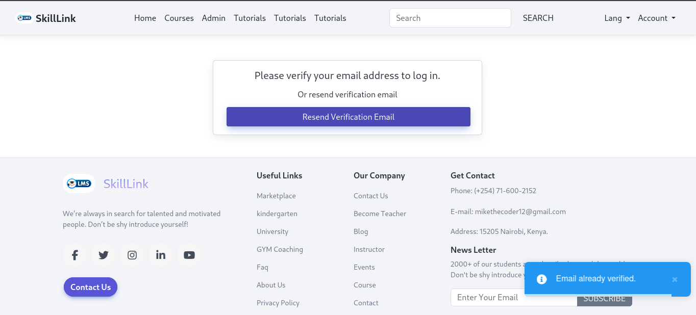
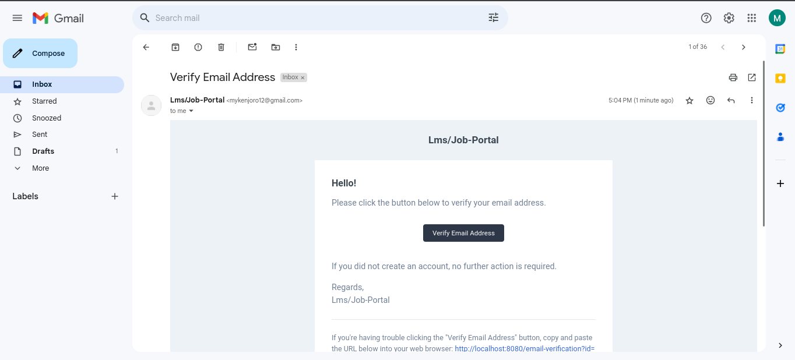
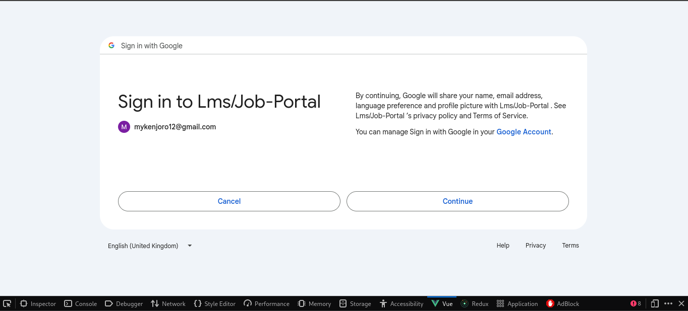
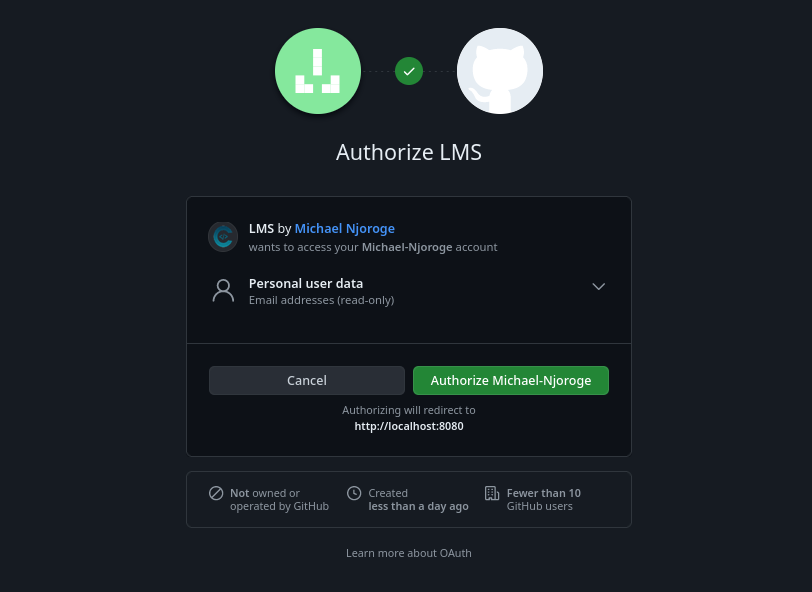
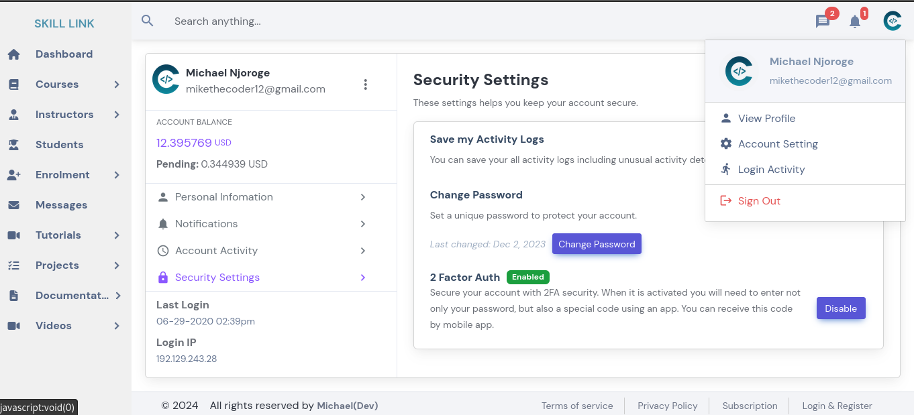
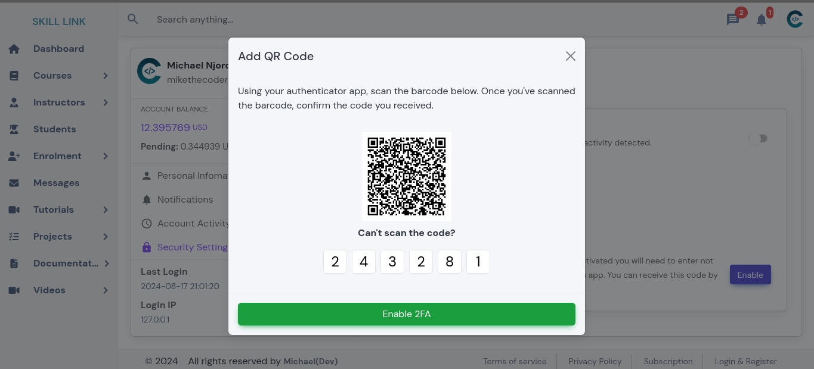

# Skilllink

Skilllink is a comprehensive Learning Management System (LMS) developed using Vue 3. It includes robust features like Vuex for state management, reusable components, admin control, and authentication using Google, Microsoft, and email verification.

## Features

- **Vue 3:** Utilizes the latest version of Vue.js for a modern and reactive user interface.
- **Vuex:** State management with Vuex to handle global application state.
- **Reusable Components:** Modular and reusable components for efficient development and maintenance.
- **Admin Control:** Full administrative control for managing users, courses, and content.
- **Authentication:** Secure authentication using Google, Microsoft, and traditional email verification.
- **Email Verification:** Ensures user authenticity through email verification.

## Screenshots

### Admin Dashboard

### Login

### Email Verification

### Sample Email Verification

### Google Auth

### Github Auth

### Profile Page 

### 2FA 

